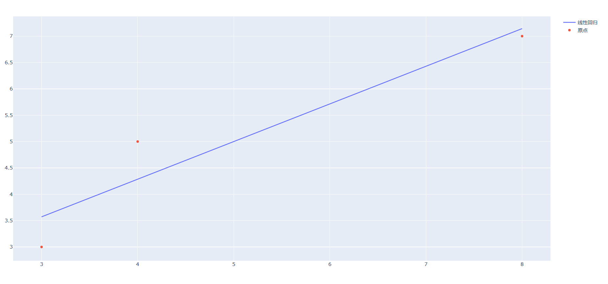
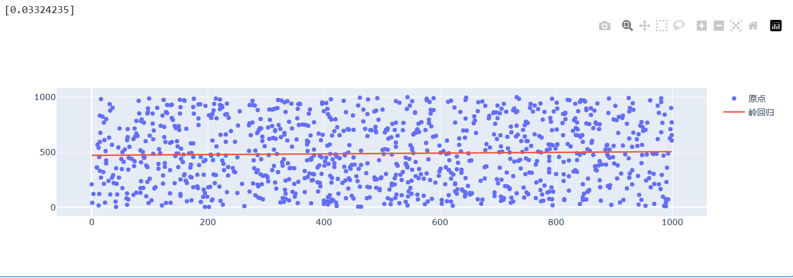

# 监督学习
- 广义线性模型

1. LinearRegression

```python
from sklearn import linear_model
import numpy as np

reg = linear_model.LinearRegression()
data_x = np.array([[3], [4], [8]])
data_y = np.array([3, 5, 7])
# 拟合模型
reg.fit(data_x, data_y)
print(reg.coef_)  # 斜率
print(reg.intercept_)  # 截距
```
    在上面的例子中我们可以进行下面的推演, 得到回归直线
```python
import numpy as np
from sklearn.linear_model import LinearRegression
import plotly.graph_objects as go

if __name__ == '__main__':

    # 创建线性回归模型
    reg = LinearRegression()
    
    # 准备数据
    data_x = np.array([[3], [4], [8]])
    data_y = np.array([3, 5, 7])
    
    # 拟合模型
    reg.fit(data_x, data_y)
    
    # 生成x的值
    x = np.array([sum(i) for i in data_x])
    
    # 预测y的值
    y_pred = x * reg.coef_ + reg.intercept_
    
    # 创建图表
    fig = go.Figure(data=[
        go.Scatter(x=x, y=y_pred, mode='lines', name='线性回归'),
        go.Scatter(x=x, y=data_y, mode='markers', name='原点')
    ])
    
    # 显示图表
    fig.show()
```


2. 岭回归
相对于普通最小二乘法， 可以防止过拟合，更健康
```python
import numpy as np
from sklearn import linear_model
import plotly.graph_objects as go

if __name__ == '__main__':
    # 随机产生实验数据
    data_x = [[np.random.randint(0, 1000, size=1)[0]] for i in range(1000)]
    data_y = np.random.randint(0, 1000, size=1000)

    # 更改参数，查看效果
    reg = linear_model.Ridge(alpha=0.5)
    reg.fit(data_x, data_y)
    x = [i[0] for i in data_x]
    print(reg.coef_)
    fig = go.Figure(data=[
        go.Scatter(x=x, y=data_y, mode='markers', name='原点'),
        go.Scatter(x=x, y=x * reg.coef_ + reg.intercept_, mode='lines', name='岭回归')
    ])
    fig.show()
```

3. Lasso
如果需要进行特征选择，Lasso可能是一个更好的选择
```python
import numpy as np
from sklearn import linear_model
import plotly.graph_objects as go

if __name__ == '__main__':
    # 随机产生实验数据
    data_x = [[np.random.normal(loc=0.0, scale=1.0, size=1)[0]] for i in range(1000)]
    data_y = np.random.normal(loc=0.0, scale=1.0, size=1000)
    # 更改参数，查看效果
    reg = linear_model.Lasso(alpha=0.5)
    reg.fit(data_x, data_y)
    x = [sum(i) for i in data_x]
    fig = go.Figure(data=[
        go.Scatter(x=x, y=data_y, mode='markers', name='原点'),
        go.Scatter(x=x, y=x * reg.coef_ + reg.intercept_, mode='lines', name='Lasso')
    ])
    fig.show()
```

4. 贝叶斯岭回归
贝叶斯岭回归对病态问题（ill-posed）的鲁棒性要更好
```python
import numpy as np
from sklearn import linear_model
import plotly.graph_objects as go

if __name__ == '__main__':
    # 随机产生实验数据
    data_x = [[np.random.normal(loc=0.0, scale=1.0, size=1)[0]] for i in range(1000)]
    data_y = np.random.normal(loc=0.0, scale=1.0, size=1000)
    # 更改参数，查看效果
    reg = linear_model.BayesianRidge()
    reg.fit(data_x, data_y)
    x = [sum(i) for i in data_x]
    y1 = reg.predict(data_x)
    fig = go.Figure(data=[
        go.Scatter(x=x, y=data_y, mode='markers', name='原点'),
        go.Scatter(x=x, y=y1, mode='markers', name='预测')
    ])
    fig.show()
```

